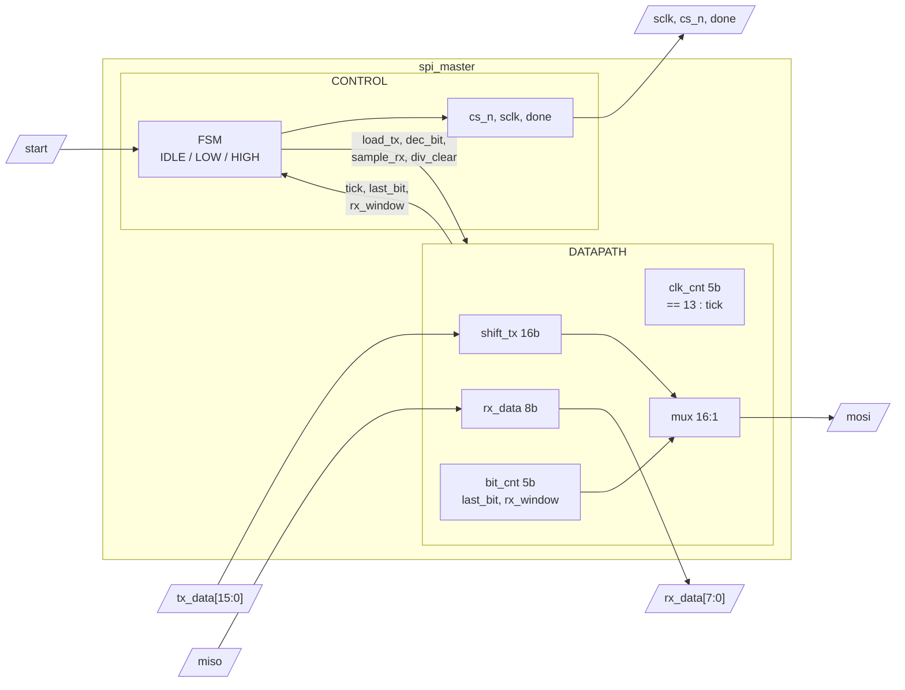

```mermaid
flowchart LR
  start[/"start"/] --> FSM
  tx[/"tx_data[15:0]"/] --> SH
  miso[/"miso"/] --> RX
 
  subgraph SPI["spi_master"]
    direction LR
    subgraph CTRL["CONTROL"]
      FSM["FSM<br/>IDLE / LOW / HIGH"]
      OUT["cs_n, sclk, done"]
    end
    subgraph DP["DATAPATH"]
      DIV["clk_cnt 5b<br/>== 13 : tick"]
      SH["shift_tx 16b"]
      BC["bit_cnt 5b<br/>last_bit, rx_window"]
      MUX["mux 16:1"]
      RX["rx_data 8b"]
    end
    FSM -- "load_tx, dec_bit,<br/>sample_rx, div_clear" --> DP
    DP -- "tick, last_bit,<br/>rx_window" --> FSM
    FSM --> OUT
    SH --> MUX
    BC --> MUX
  end
 
  MUX --> mosi[/"mosi"/]
  OUT --> pins[/"sclk, cs_n, done"/]
  RX --> rxd[/"rx_data[7:0]"/]
```
