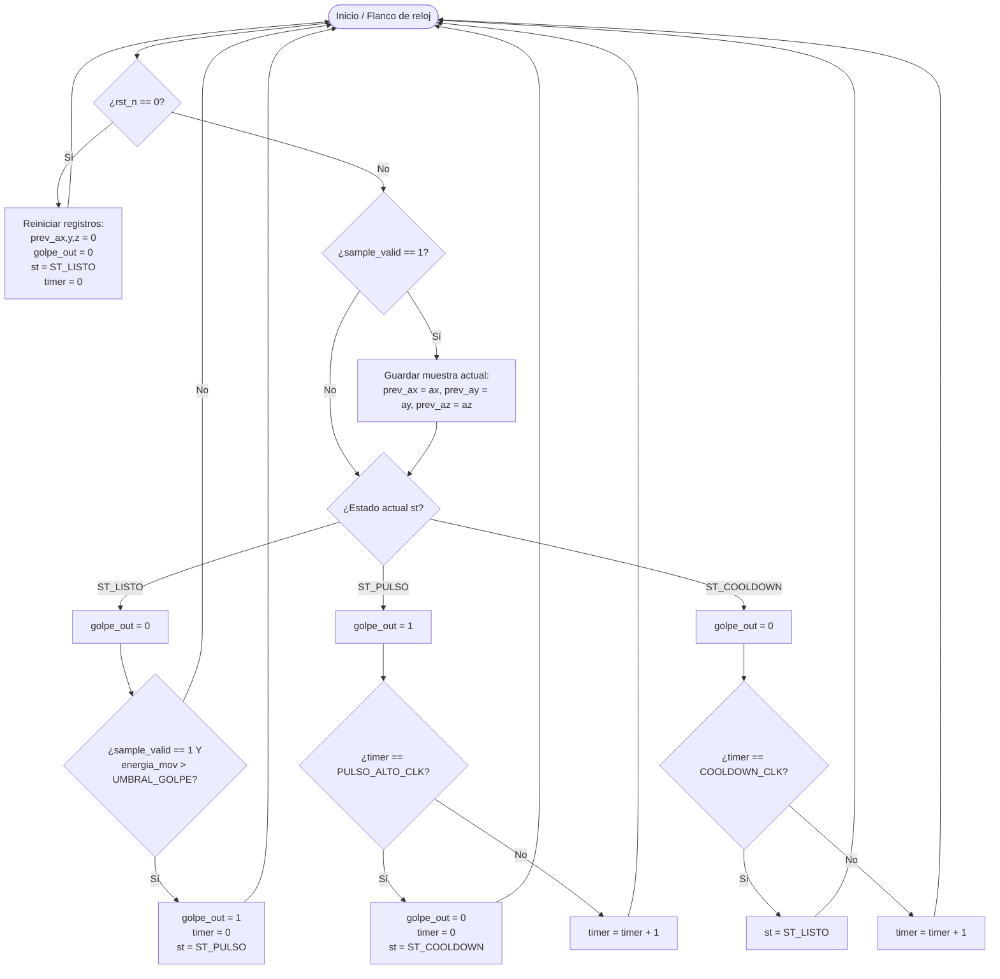

```mermaid
flowchart TD
    Inicio([Inicio / Flanco de reloj]) --> Rst{¿rst_n == 0?}
    Rst -- Sí --> Reset["Reiniciar registros:<br/>prev_ax,y,z = 0<br/>golpe_out = 0<br/>st = ST_LISTO<br/>timer = 0"]
    Reset --> Inicio

    Rst -- No --> Val{¿sample_valid == 1?}
    Val -- Sí --> SavePrev["Guardar muestra actual:<br/>prev_ax = ax, prev_ay = ay, prev_az = az"]
    Val -- No --> CaseSt
    SavePrev --> CaseSt

    CaseSt{¿Estado actual st?}

    %% Estado ST_LISTO
    CaseSt -- ST_LISTO --> L1["golpe_out = 0"]
    L1 --> L2{"¿sample_valid == 1 Y<br/>energia_mov > UMBRAL_GOLPE?"}
    L2 -- Sí --> L3["golpe_out = 1<br/>timer = 0<br/>st = ST_PULSO"]
    L2 -- No --> Inicio
    L3 --> Inicio

    %% Estado ST_PULSO
    CaseSt -- ST_PULSO --> P1["golpe_out = 1"]
    P1 --> P2{"¿timer == PULSO_ALTO_CLK?"}
    P2 -- Sí --> P3["golpe_out = 0<br/>timer = 0<br/>st = ST_COOLDOWN"]
    P2 -- No --> P4["timer = timer + 1"]
    P3 --> Inicio
    P4 --> Inicio

    %% Estado ST_COOLDOWN
    CaseSt -- ST_COOLDOWN --> C1["golpe_out = 0"]
    C1 --> C2{"¿timer == COOLDOWN_CLK?"}
    C2 -- Sí --> C3["st = ST_LISTO"]
    C2 -- No --> C4["timer = timer + 1"]
    C3 --> Inicio
    C4 --> Inicio
```
