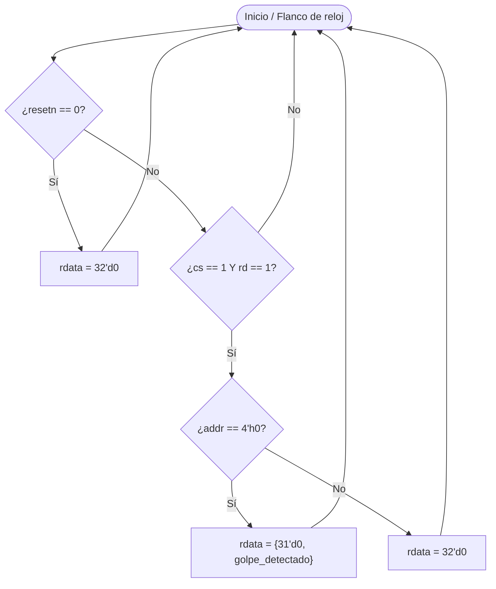

```mermaid
flowchart TD
    Inicio([Inicio / Flanco de reloj]) --> Rst{¿resetn == 0?}
    Rst -- Sí --> Clear["rdata = 32'd0"]
    Clear --> Inicio

    Rst -- No --> ReadEn{"¿cs == 1 Y rd == 1?"}
    ReadEn -- No --> Inicio
    ReadEn -- Sí --> CheckAddr{"¿addr == 4'h0?"}

    CheckAddr -- Sí --> OutGolpe["rdata = {31'd0, golpe_detectado}"]
    CheckAddr -- No --> OutZero["rdata = 32'd0"]

    OutGolpe --> Inicio
    OutZero --> Inicio
```
