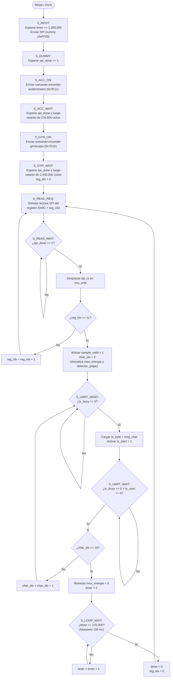

```mermaid
flowchart TD
    Inicio([Reset / Inicio]) --> Boot["S_BOOT:<br/>Esperar timer == 1,350,000<br/>Enviar SPI Dummy (0xFF00)"]
    Boot --> Dummy["S_DUMMY:<br/>Esperar spi_done == 1"]
    Dummy --> AccOn["S_ACC_ON:<br/>Enviar comando encender<br/>acelerómetro (0x7E11)"]
    AccOn --> AccWait["S_ACC_WAIT:<br/>Esperar spi_done y luego<br/>retardo de 270,000 ciclos"]
    AccWait --> GyrOn["S_GYR_ON:<br/>Enviar comando encender<br/>giroscopio (0x7E15)"]
    GyrOn --> GyrWait["S_GYR_WAIT:<br/>Esperar spi_done y luego<br/>retardo de 2,430,000 ciclos<br/>reg_idx = 0"]

    %% Bucle principal de lectura
    GyrWait --> ReadReq["S_READ_REQ:<br/>Solicitar lectura SPI del<br/>registro (0x0C + reg_idx)"]
    ReadReq --> ReadWait{"S_READ_WAIT:<br/>¿spi_done == 1?"}
    ReadWait -- No --> ReadWait
    ReadWait -- Sí --> Shift["Desplazar spi_rx en imu_shift"]
    Shift --> CheckIdx{"¿reg_idx == 11?"}
    CheckIdx -- No --> IncIdx["reg_idx = reg_idx + 1"]
    IncIdx --> ReadReq

    CheckIdx -- Sí --> Valid["Activar sample_valid = 1<br/>char_idx = 0<br/>(Actualiza max_energia y detector_golpe)"]

    %% Bucle de envío UART
    Valid --> UartSend{"S_UART_SEND:<br/>¿tx_busy == 0?"}
    UartSend -- No --> UartSend
    UartSend -- Sí --> SendChar["Cargar tx_byte = msg_char<br/>Activar tx_start = 1"]
    SendChar --> UartWait{"S_UART_WAIT:<br/>¿tx_busy == 0 Y tx_start == 0?"}
    UartWait -- No --> UartWait
    UartWait -- Sí --> CheckChar{"¿char_idx == 16?"}
    CheckChar -- No --> IncChar["char_idx = char_idx + 1"]
    IncChar --> UartSend

    CheckChar -- Sí --> ClearMax["Reiniciar max_energia = 0<br/>timer = 0"]
    ClearMax --> LoopWait{"S_LOOP_WAIT:<br/>¿timer == 270,000?<br/>(Muestreo 100 Hz)"}
    LoopWait -- No --> IncTimer["timer = timer + 1"]
    IncTimer --> LoopWait
    LoopWait -- Sí --> ResetLoop["timer = 0<br/>reg_idx = 0"]
    ResetLoop --> ReadReq
```
