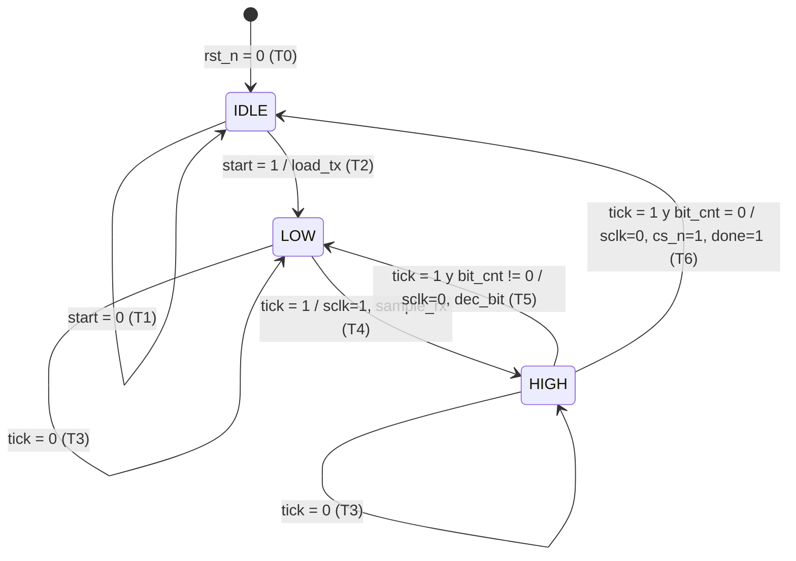

| Estado | `state` | `sclk` | Salidas |
|---|---|---|---|
| IDLE | 0 | 0 | `cs_n = 1` |
| LOW (espera subida) | 1 | 0 | `cs_n = 0` |
| HIGH (espera bajada) | 1 | 1 | `cs_n = 0` |
 

```mermaid
stateDiagram-v2
  [*] --> IDLE : rst_n = 0 (T0)
  IDLE --> IDLE : start = 0 (T1)
  IDLE --> LOW : start = 1 / load_tx (T2)
  LOW --> LOW : tick = 0 (T3)
  LOW --> HIGH : tick = 1 / sclk=1, sample_rx (T4)
  HIGH --> HIGH : tick = 0 (T3)
  HIGH --> LOW : tick = 1 y bit_cnt != 0 / sclk=0, dec_bit (T5)
  HIGH --> IDLE : tick = 1 y bit_cnt = 0 / sclk=0, cs_n=1, done=1 (T6)
```
